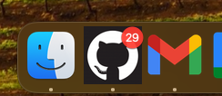

# GitHub app badge notification

Chrome extension for showing notifications in a badge when GitHub is installed as a PWA.

## Setup

1. Install the extension from Chrome Web Store.
2. Add GitHub as an app. You can do so by following [this guide](https://support.google.com/chrome_webstore/answer/3060053?hl=en). **Make sure to select the option "open as a window".**
3. Open the app.

## Cross-platform support

The badge should work with MacOS, Windows and many phone browsers, however it doesn't work on Linux (apparently). More details [here](https://developer.mozilla.org/en-US/docs/Web/Progressive_web_apps/How_to/Display_badge_on_app_icon).

## Attribution

This codebase is a modified copy of Domenico Gemoli's [gmail-app-badge-notification](https://github.com/aberonni/gmail-app-badge-notification). Many thanks to his work!
